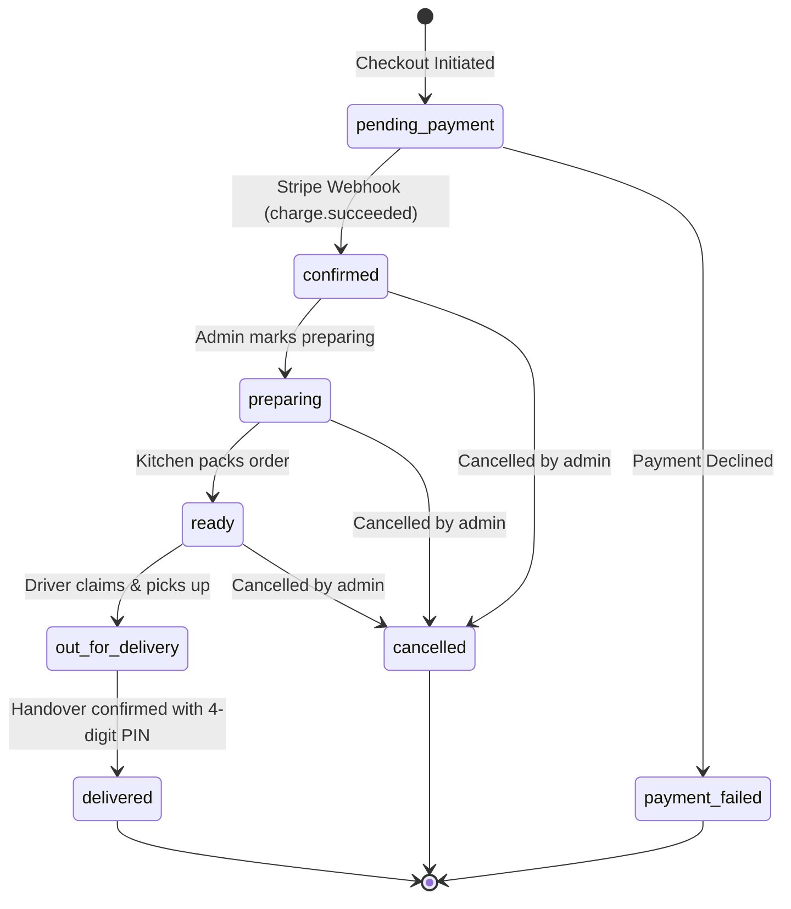

# 🏛️ Chowly System Architecture

This document details the architectural decisions, data models, lifecycle state machines, and concurrency patterns powering the Chowly platform.

---

## 1. System Overview

Chowly is organized as a three-component system against a unified MongoDB datastore:

```
                      ┌─────────────────────────────────────────┐
                      │              Clients                    │
                      ├───────────────────┬─────────────────────┤
                      │  Mobile (Expo 57) │  Admin (Vite React) │
                      │  Customer / Driver│  Backoffice         │
                      └─────────┬─────────┴──────────┬──────────┘
                                │                    │
                        Bearer  │                    │ HTTP-only Cookie
                        Token   │                    │ Transport
                                ▼                    ▼
                      ┌─────────────────────────────────────────┐
                      │         Express 5 API (/api/v1)         │
                      ├─────────────────────────────────────────┤
                      │  Zod Validation -> Controllers          │
                      │  Domain Services -> Mongoose Models     │
                      └─────────┬─────────┬──────────┬──────────┘
                                │         │          │
                       Mongoose │         │ SDK      │ Signed
                                ▼         ▼          ▼
                        [( MongoDB )] [Stripe] [Cloudinary]
```

---

## 2. Authentication & Authorization

Chowly uses a **unified Passport JWT strategy** with dual transport support:

```typescript
// api/src/config/passport.config.ts
ExtractJwt.fromExtractors([
  cookieExtractor,                                 // Admin: auth_token HTTP-only cookie
  ExtractJwt.fromAuthHeaderAsBearerToken()         // Mobile: Authorization: Bearer <token>
])
```

- **Admin Web:** The JWT is issued via an `auth_token` cookie with `httpOnly: true`, `sameSite: "lax"`, and `secure: true` in production, protecting backoffice sessions from XSS attacks.
- **Mobile Client:** The token is stored in the hardware keychain via `expo-secure-store` (with `localStorage` fallback on web) and transmitted via the `Authorization` header.
- **Role Guards:** Endpoints use `requireAuth` and `requireRole("admin" | "driver" | "customer")`.

---

## 3. Order Lifecycle State Machine

Orders follow a validated transition path:



### Transition Authority

| Transition | Authorized Role | Mechanism |
| :--- | :--- | :--- |
| `pending_payment` $\rightarrow$ `confirmed` | **System (Stripe)** | Verified Stripe webhook handler |
| `confirmed` $\rightarrow$ `preparing` $\rightarrow$ `ready` | **Admin** | Admin Order Queue UI |
| `ready` $\rightarrow$ `ready` *(Claim)* | **Driver** | Atomic `findOneAndUpdate` query |
| `ready` $\rightarrow$ `out_for_delivery` | **Driver** | Pickup action in Driver App |
| `out_for_delivery` $\rightarrow$ `delivered` | **Driver** | Handover PIN verification matching `deliveryCode` |
| `out_for_delivery` $\rightarrow$ `ready` *(Release)* | **Admin** | Release stranded driver back to queue |

---

## 4. Key Engineering Patterns

### A. Zero-Float Financial Math
To eliminate floating-point rounding errors common in currency arithmetic, all monetary amounts are stored strictly as **integer minor units** (e.g. `$14.50` = `1450` cents):

```typescript
total = subtotal + deliveryFee + serviceFee;
restaurantPayout = subtotal - commission;
driverPayout = basePay + Math.round(distanceKm * payPerKm);
```
Prices sent from the client during checkout are never trusted; the backend recomputes all totals from database dish records at the time of order creation.

### B. Atomic Driver Job Claiming
When multiple drivers race to accept a lucrative delivery from the queue, a traditional read-then-update approach risks assigning the same delivery to multiple riders. Chowly solves this with an atomic query:

```typescript
// api/src/services/driver.service.ts
const claimed = await OrderModel.findOneAndUpdate(
  {
    _id: orderId,
    driver: { $exists: false },
    status: "ready"
  },
  {
    $set: { driver: driverSnapshot(driver), driverPayout: payout },
    $push: { statusHistory: { status: "ready", note: `Claimed by ${driver.name}`, at: new Date() } }
  },
  { returnDocument: "after" }
);

if (!claimed) throw new BadRequestException("Another rider claimed this delivery");
```

### C. Doorstep PIN Verification
Each order generates a random 4-digit confirmation code (`deliveryCode`). To ensure the driver cannot see the code in advance:
1. `deliveryCode` is marked `{ select: false }` on the Mongoose Order schema.
2. The code is only returned to the customer who placed the order.
3. When the driver calls `markDelivered(orderId, code)`, the backend explicitly queries `.select("+deliveryCode")` and validates the driver input against the secret.

### D. Stripe Webhook Idempotency
Because webhooks can be retried by Stripe over unreliable networks:
1. Webhooks are mounted before `express.json` using `express.raw()` to verify the exact cryptographic signature.
2. Every processed event ID is recorded in the `ProcessedWebhookEvent` collection. Replayed events are acknowledged immediately without duplicating order transitions.

---

## 5. Development Mock Architecture

For fast previewing without a database or third-party accounts:
- **Admin App:** Custom Axios adapter in `admin/src/lib/axios-client.ts` intercepts mock requests when `admin@chowly.app` is logged in, serving mock analytics and catalog data.
- **Mobile App:** Custom Axios adapter in `mobile/src/lib/axios-client.ts` intercepts mock requests when `customer@chowly.app` or `driver@chowly.app` is logged in, providing a seamless live preview in the browser or on device.
