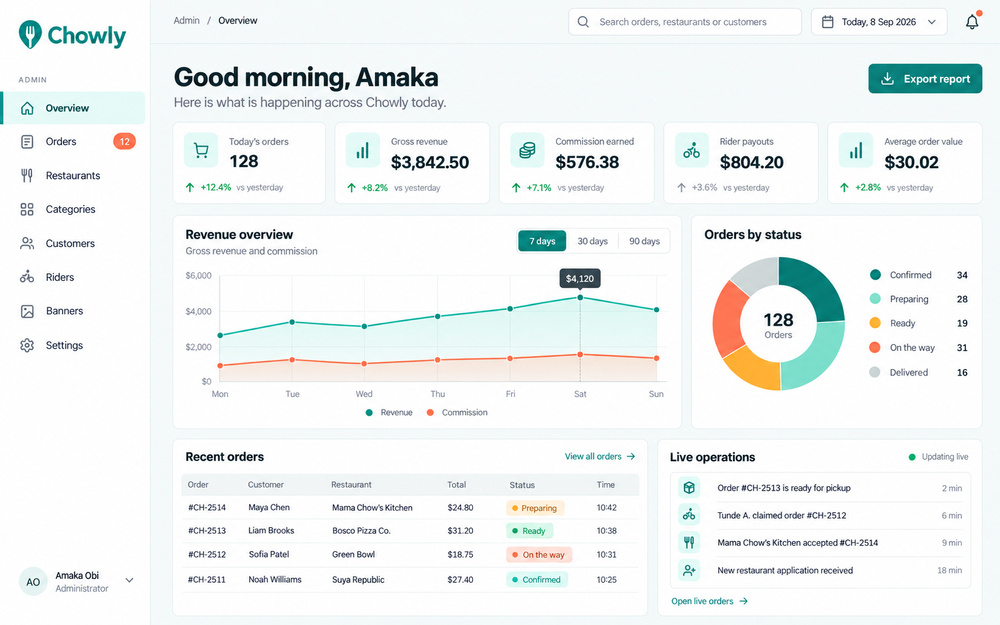
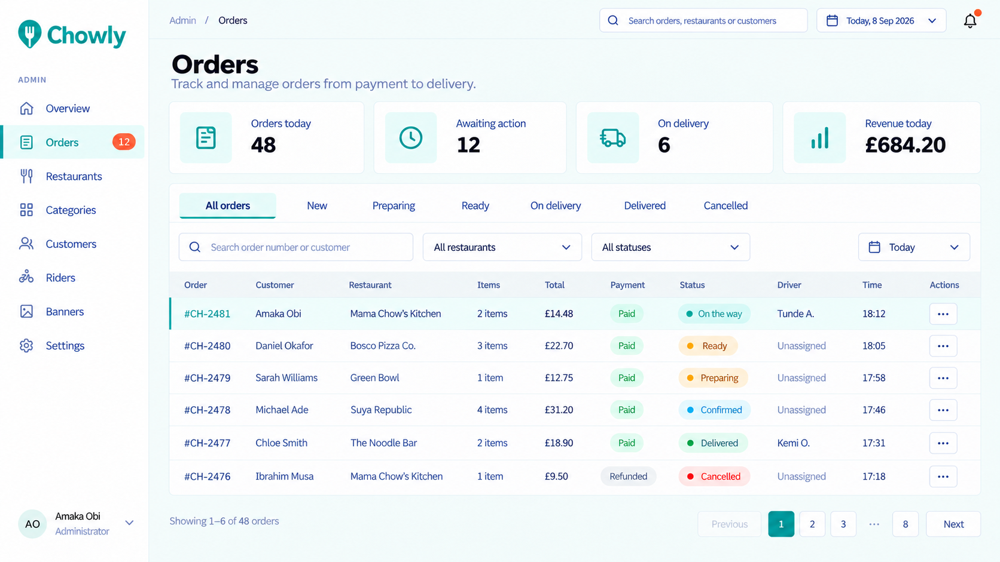
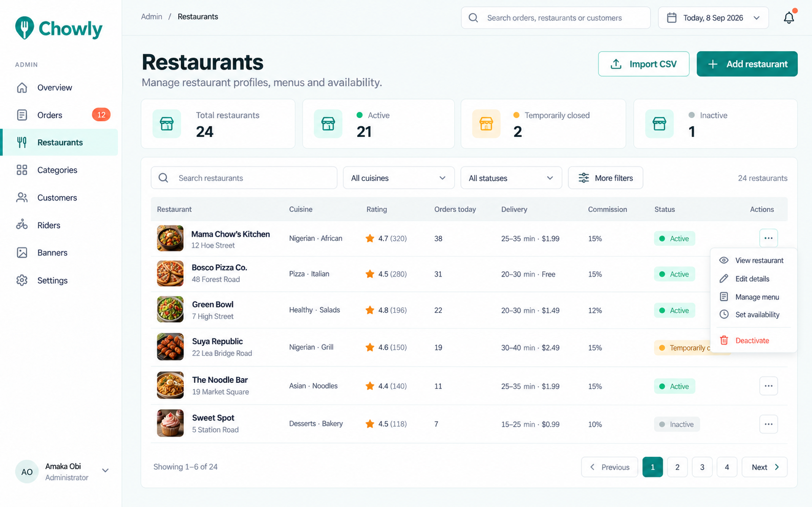
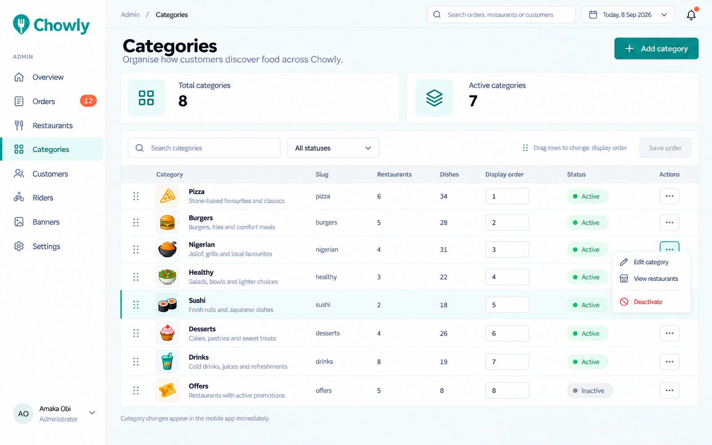
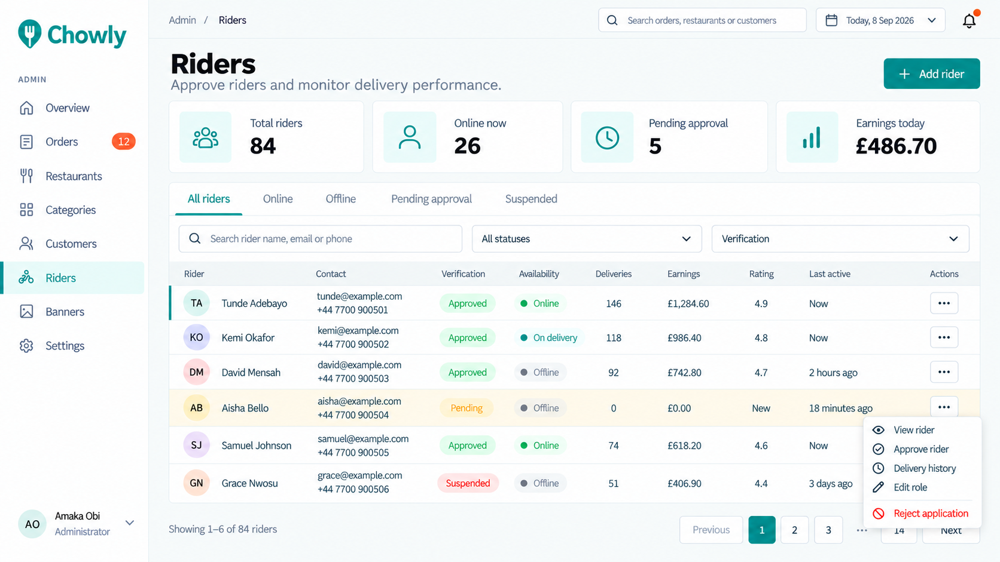
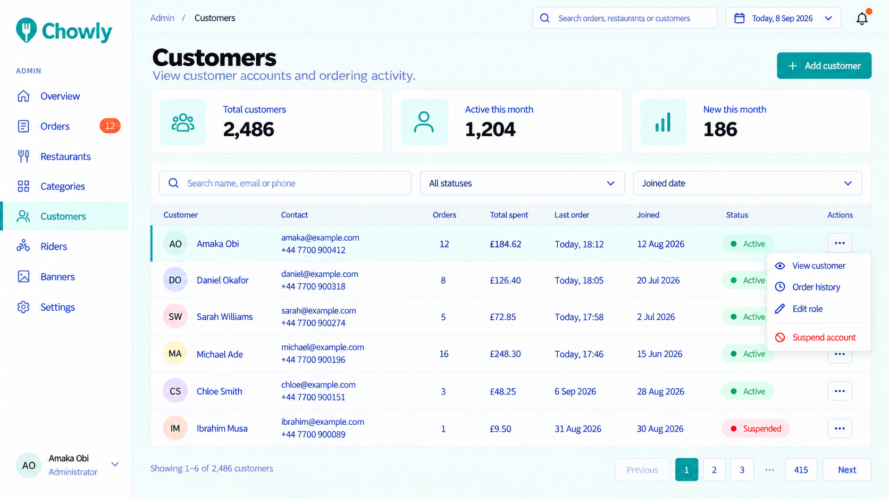
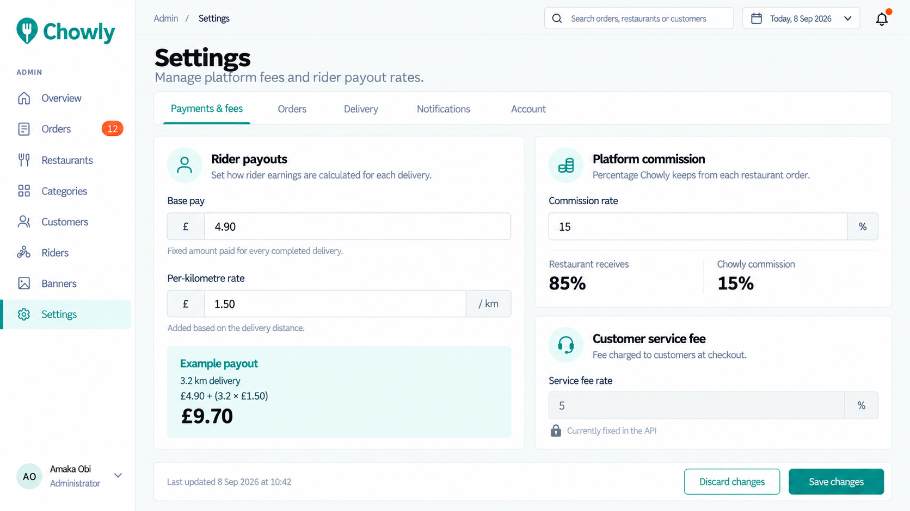
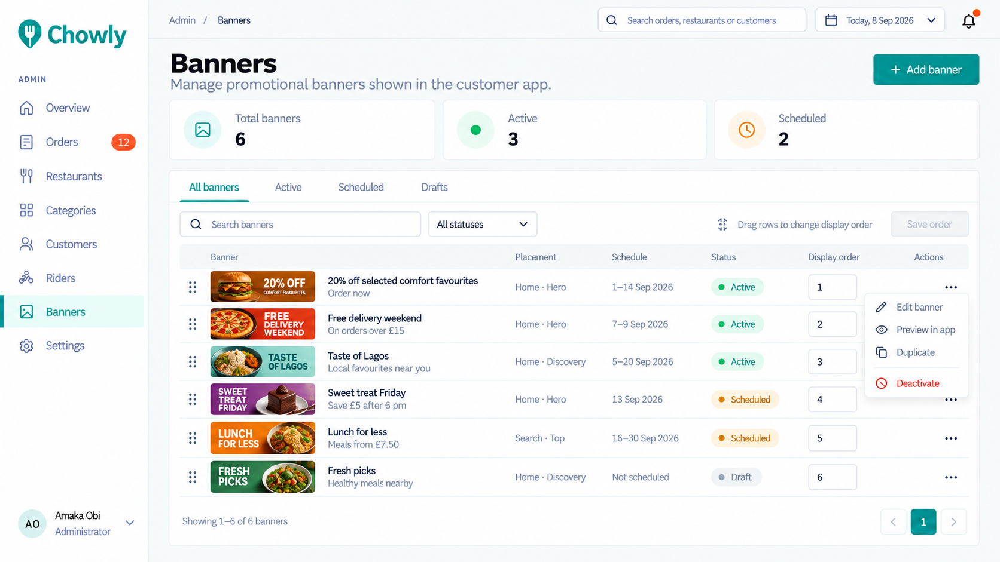

# 🖥️ Chowly Admin Backoffice

> Real-time operations and catalog management web portal for the Chowly platform.

Built with **Vite 8**, **React 19**, **Tailwind CSS v4**, and **shadcn/ui** components.

---

## ✨ Features

- 🔐 **Admin Authentication:** Protected route guards and session boundary.
- 📈 **Executive Analytics:** Real-time metrics, revenue trajectory charts, status distribution donuts, and live operation event stream.
- 🧾 **Live Order Queue:** Monitor orders, view payout/commission splits, advance order preparation statuses (`confirmed` $\rightarrow$ `preparing` $\rightarrow$ `ready`), and release stalled orders back to the driver queue.
- 🏪 **Restaurant & Menu Management:** Restaurant profiles, opening hours, delivery fees, minimum order values, and dishes with customizable option groups (radios/checkboxes).
- 🗂️ **Categories with Drag & Drop:** Visual category hierarchy with `@dnd-kit` drag-and-drop ordering.
- 🚴 **Driver Fleet Operations:** View driver availability, approve new drivers, view earnings history, and suspend accounts.
- 👥 **Customer Management:** Customer spending summaries and account status toggles.
- 🖼️ **Promotional Banners:** Schedule home carousel banners with target categories and active date windows.
- ⚙️ **Platform Settings:** Configure driver base pay, mileage rate (per km), restaurant commission percentage, and service fee rate.
- 🧪 **Built-in Dev Mock Mode:** Fully functional interactive preview without needing a running database.

---

## 📸 Screen Gallery

| Executive Analytics & Metrics | Live Orders Management |
| :---: | :---: |
|  |  |

| Restaurant & Menus CRUD | Drag & Drop Categories |
| :---: | :---: |
|  |  |

| Rider Fleet Management | Customer Accounts |
| :---: | :---: |
|  |  |

| Platform Commission & Pay Settings | Banner Carousel Scheduler |
| :---: | :---: |
|  |  |

---

## 🛠️ Tech Stack

- **Framework:** React 19 + TypeScript
- **Bundler:** Vite 8
- **Routing:** React Router v7/v8
- **Server State:** TanStack Query v5
- **Data Tables:** TanStack Table v9
- **Drag & Drop:** `@dnd-kit/core` & `@dnd-kit/sortable`
- **Charts:** Recharts
- **Styling:** Tailwind CSS v4 + Radix UI + Lucide Icons + Geist Variable Font
- **Feedback:** Sonner rich toasts
- **Linter:** Oxlint (fast Rust-based linter)

---

## 🚀 Getting Started

### 1. Installation

```bash
cd admin
npm install
```

### 2. Environment Variables (Optional)

Create `.env` based on `.env.example`:

```bash
cp .env.example .env
```

| Variable | Description |
| :--- | :--- |
| `VITE_API_URL` | Base URL of the API. Leave empty in production (since the API serves the admin from the same origin) or set to `http://localhost:8000/api/v1` in standalone development. |

### 3. Start Development Server

```bash
npm run dev
```

Open [`http://localhost:5173`](http://localhost:5173) in your browser.

---

## 🔑 Dev Mock Login (No Database Required)

You can explore and test the entire admin backoffice without connecting MongoDB or the API:

- **Login URL:** `http://localhost:5173/login`
- **Email:** `admin@chowly.app`
- **Password:** `admin123` *(or any password)*

*Note: The login page remains clean and production-styled with zero mock badges or buttons.*

---

## 📁 Directory Architecture

```
admin/src/
├── assets/          # Brand images and backgrounds
├── components/      # Reusable UI primitives (dialogs, tables, forms, badges, sidebar)
├── features/        # Feature queries & mutations (auth, orders, restaurants, settings)
├── hooks/           # Custom React hooks (debounce, responsive)
├── layout/          # AppLayout, sidebar navigation, topbar header
├── lib/             # Axios client, mock adapter, TanStack query client
├── pages/           # Route views
│   ├── auth/        # Sign-in & no-access pages
│   ├── banners/     # Promotional carousel manager
│   ├── categories/  # Category drag & drop manager
│   ├── customers/   # Customer list & details
│   ├── dashboard/   # Analytics & live operations feed
│   ├── orders/      # Live queue & order details
│   ├── restaurants/ # Restaurant & dish editor
│   ├── riders/      # Driver fleet management
│   └── settings/    # Financial rates & platform fees
└── routes/          # ProtectedRoute and PublicOnlyRoute shells
```

---

## 📦 Production Build

```bash
npm run build     # Typechecks and builds production bundle to admin/dist
```
The compiled output in `admin/dist` is served directly by the Express backend in production.
